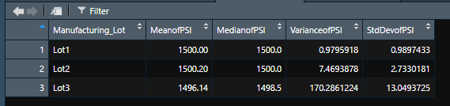
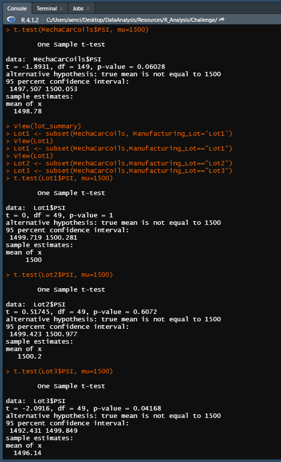

# MechaCar Statistical Analysis
In this challenge, Jeremy has been asked by upper management to run analysis on a prototype that the company has been working on: the MechaCar. Jeremy has been asked to run analysis on various factors of production to aid the manufacturing team. Below, I uncover significant factors that impact the MechaCar's performance and provide a written analysis of those findings.

## Linear Regression to Predict MPG 
Using linear regression, we were able to determine key statistical factors that impact the MechaCar's MPG. Below is our R result:

1. From the results, we can see that both vehicle length and ground clearance very likely provide non-random variance to the MPG ratings for the MechaCar. In some way, vehicle lenght and grouund clearance have an impact on MPG, and these should be monitored by the manufacturing team. Every other measure seems to only provide random variance, or no measureable impact on MPG, although vehicle weight is just outside a significant p-value (.05). Although this eludes that weight only provides random variance, perhaps the manufacturing team should continue to monitor weight, at least closer that the other measures which seem to be truly random in variance.
2. The slope of this linear model can be determined to be zero or not zero by its p-value. The p-value of the test is 5.35e-11, which is a very small value, much smaller than 0.05. From this we can determine that the slope is not zero. 
3. The accuracy of the model to predict MPG of the MechaCar can be determined from the generated r-squared value. The r-squared model of the model is 0.7149. This means that the linear regression generated predicts about 71% of the MPG in respect to additional factors. Since the r-squared value is significantly higher than 50%, I would say that 71% is high enough to conclude that this model can accurately predict MPG of the MechaCar prototypes.

## Summary Statistics on Suspension Coils
After running analysis on suspension coils data, we were able to collect the following data on all 3 lots of coils:

1. From the provided data and the resulting summaries, we can see the variance of the suspension coils. The manufactuing team has stated that variance must not exceed 100 PSI. The summary of all lots (total summary) indicates that the variance is 62.29 PSI. From this test alone, we can conclude that all manufacturing lots in total are compliant to specification, as 62 is lower than the standard of 100. However, when we break the summaries down by lot batch, we have a different story. Lot 1 and 2 are compliant with a variance of 0.97 and 7.46 respectively. Lot 3, however, has a variance of 170.28, which does not meet the set specification. Because of the variance of Lot 3, not all lots meet the specification of under 100 PSI.

## T-Tests on Suspension Coils
Finally, I executed analysis on the suspension coil data to get t-test data on each Lot:

1. First, I ran a t-test on the complete coil dataset. Using the population mean of coil PSI set at 1500, we found that our actual mean is 1498.78. The purpose of this t-test is to determine if the PSI across all lots is statistically different than the population mean. The p-value of this test is 0.06, just shy of statistical difference. As a result, we can conclude that there is no difference between the total of the lots and the population PSI Mean. 
2. I then ran a t-test on each lot compared to the population mean. Lot 1 had an identical mean to the population and a p-value of 1, so there is no difference between this sample and the population. Lot 2 had a mean slightly higher than the population, coming in a 1500.2, and a p-value of 0.60. Similar to Lot 1, Lot 2 is not statistically different from the population. Lot 3 had a mean of 1496.14 and a p-value of 0.04. Because of the p-value calculated, there is a statistical difference between Lot 3 and the population.

## Study Design: MechaCar vs Competition
In addition to the analysis provided, Jeremy has also been asked to design a statistical study on how to measure MechaCar against the competition. Below is an idea of how they could accomplish that study. In the study, we will be interested in discovering what sets the MechaCar apart from the competition. Since it seems that the MechaCar is considering All Wheel Drive, let's measure if there is a difference between AWD/no AWD models and the safety rating and MPG. All three of these metrics are important to the consumer.
1. Metric - Some of the previously provided metrics (in the MPG dataset) could be reused in this study, as all metrics should be available from the competitors. We can collect MPG, drivetrain (AWD), and then additional metrics such as safety rating. 
2. Hypothesis - The null hypothesis would be there is no statistical impact on MPG and Safety Rating based on the drivetrain. The alternative hypothesis would be there is a statistical difference on MPG and Safety Rating depending on drivetrain. 
3. Statistical Test - I would utilize a multiple linear regression to determine whether or not I reject the null hypothesis, similar to how we did it in this challenge. From the two models I would run, we can clearly display the results of MPG based on wether the vehicle has AWD, front wheel drive, or rear wheel drive, as well as the safety rating based on AWD, FWD, and RWD. If this test is done pre-production, the MechaCar could be trainsitioned to get the best of both worlds, depending on how the data came back.
4. Data - For this test to work, we would need the safety ratings of each vehicle to be compared, as well as the fuel efficiency in Miles per Gallon. We would also need the drivetrain of each vehicle. We could then manipulate the data to get the mean of MPG per drivetrain and mean of safety per drivetrain to more easily compare them.
