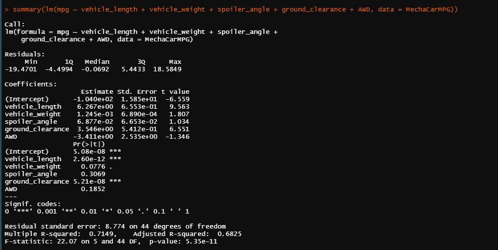

# MechaCar Statistical Analysis
In this challenge, Jeremy has been asked by upper management to run analysis on a prototype that the company has been working on: the MechaCar. Jeremy has been asked to run analysis on various factors of production to aid the manufacturing team. Below, I uncover significant factors that impact the MechaCar's performance and provide a written analysis of those findings.

## Linear Regression to Predict MPG 
Using linear regression, we were able to determine key statistical factors that impact the MechaCar's MPG. Below is our R result:

1. From the results, we can see that both vehicle length and ground clearance very likely provide non-random variance to the MPG ratings for the MechaCar. In some way, vehicle lenght and grouund clearance have an impact on MPG, and these should be monitored by the manufacturing team. Every other measure seems to only provide random variance, or no measureable impact on MPG, although vehicle weight is just outside a significant p-value (.05). Although this eludes that weight only provides random variance, perhaps the manufacturing team should continue to monitor weight, at least closer that the other measures which seem to be truly random in variance.
2. The slope of this linear model can be determined to be zero or not zero by its p-value. The p-value of the test is 5.35e-11, which is a very small value, much smaller than 0.05. From this we can determine that the slope is not zero. 
3. The accuracy of the model to predict MPG of the MechaCar can be determined from the generated r-squared value. The r-squared model of the model is 0.7149. This means that the linear regression generated predicts about 71% of the MPG in respect to additional factors. I would say that 71% is high enough to conclude that this model can accurately predict MPG of the MechaCar prototypes.

 
